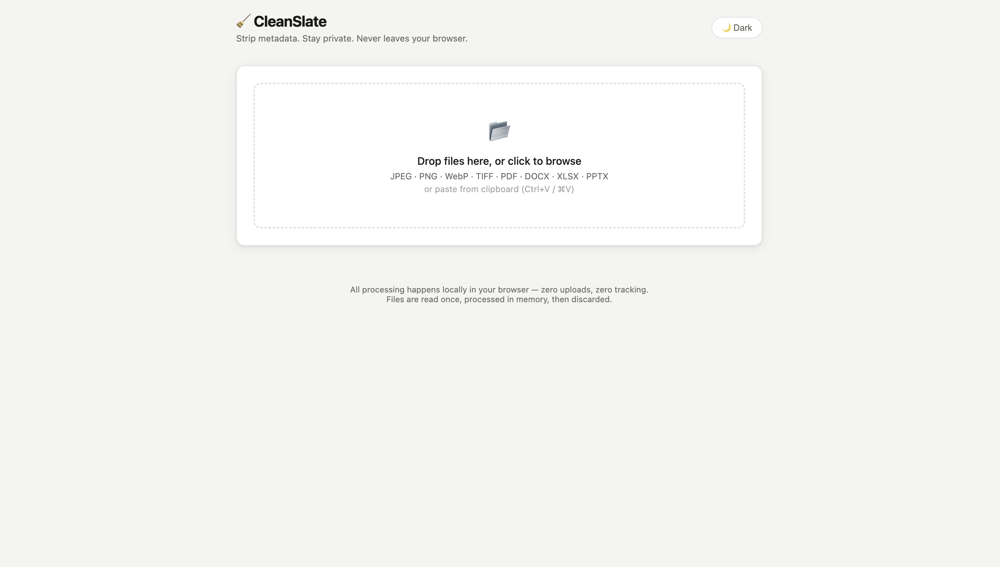

# 🧹 CleanSlate

[](https://opensource.org/licenses/MIT)
[]()
[]()

**Strip metadata from files without uploading them anywhere.**

<p align="center">
  
</p>

CleanSlate is a privacy-first metadata cleaner that runs entirely in your browser. Drop in images, PDFs, or Office documents, see exactly what metadata is buried in them, then download clean versions. No servers, no tracking, no sign-up, no nothing.

---

## Features

- **Drag-and-drop, click-to-browse, or paste** — Ctrl+V / ⌘V to drop a clipboard image straight in
- **Image thumbnails** — see what you're working on at a glance
- **Metadata preview before cleaning** — actually see what's in there (camera model, GPS coordinates, author name, software used, timestamps…)
- **Before → after file size** — shows exactly how much weight was cut, with the percentage saved in green
- **Stripped fields confirmation** — after cleaning, the card shows exactly which fields were removed
- **Fully client-side** — everything runs in memory in your browser, nothing ever touches a server
- **Installable PWA** — works completely offline and can be installed as a standalone app on your desktop or phone
- **Batch download** — clean one file or grab the whole lot as a ZIP
- **Dark / light mode** — follows your system setting by default, manual toggle saves your preference
- **Keyboard accessible** — Tab to the drop zone, Enter/Space to open the file picker
- **No install, no build step** — just open `index.html` and it works

---

## Supported Formats

| Format | What gets removed |
|--------|-------------------|
| **JPEG** | EXIF (camera, GPS, dates, software), XMP, IPTC, comments |
| **PNG** | `tEXt`, `iTXt`, `zTXt`, `eXIf`, `tIME`, `iCCP` chunks |
| **WebP** | EXIF, XMP, ICC profile (VP8X extended format) |
| **TIFF** | Make, Model, Software, DateTime, Artist, Copyright, description |
| **SVG** | `<metadata>`, `<title>`, `<desc>`, editor namespaces (Inkscape/Illustrator), comments, and dangerous `<script>` tags |
| **PDF** | Title, Author, Subject, Keywords, Creator, Producer, dates, XMP stream |
| **DOCX / XLSX / PPTX** | Document properties (`core.xml`, `app.xml`, `custom.xml`), preview thumbnails (`thumbnail.*`), embedded media EXIF/metadata, and normalized timestamps |
| **MP3** | ID3v2 text frames (Artist, Title, Album, Encoder, Comments, Album art) and trailing ID3v1 tags |
| **MP4 / M4A / MOV** | GPS coordinates (`©xyz`), QuickTime user-data atoms (`udta`, `meta`), title/author tags, and container creation timestamps |

---

## How It Works

### Images (JPEG / PNG / WebP / TIFF)
Files are parsed at the binary level with `ArrayBuffer` and `DataView`. Metadata segments get identified by their format markers and dropped when the output is written — the actual image data is never touched.

### Vector Graphics (SVG)
Parsed with native `DOMParser`. Metadata blocks, RDF elements, editor namespaces (Inkscape, Illustrator, Figma), comments, and executable `<script>` tags are sanitized and stripped while keeping vector paths and styling intact.

### Audio (MP3)
ID3v2 headers and frames at the front of the file and ID3v1 trailers at the end of the file are stripped losslessly at the byte level without recompressing the audio stream.

### Video & Containers (MP4 / M4A / MOV)
ISO Base Media format boxes are parsed to locate `udta` (user data) and `meta` tags. Boxes carrying GPS coordinates and personal tags are safely neutralized to `free` filler boxes, and container timestamps in `mvhd`/`tkhd` are zeroed out — preserving 100% sample table offset integrity (`stco`/`co64`) without video re-encoding.

### PDFs
Info dictionary fields get overwritten in-place with spaces of the same byte length, keeping the cross-reference table intact without needing a full PDF parser.

### Office Documents
DOCX, XLSX, and PPTX files are Open Packaging Conventions (OPC) ZIP archives. [JSZip](https://stuk.github.io/jszip/) unpacks them, optional metadata parts (`core.xml`, `app.xml`, `custom.xml`, and preview thumbnails) are stripped, dangling relationship references in `_rels` and `[Content_Types].xml` are cleaned with native XML DOM parsing, embedded media images are scrubbed of EXIF metadata, archive timestamps are normalized to epoch 0, and the package structure is validated before saving.

---

## Usage

```bash
git clone https://github.com/CasualcoderDev/CleanSlate.git
cd CleanSlate
open index.html   # or just double-click it in Finder/Explorer
```

No `npm install`. No build step. Just open and go.

> **Heads up:** Office file support (DOCX, XLSX, PPTX) loads JSZip from a CDN, so you'll need an internet connection the first time for those. Every other format works completely offline.

---

## File Structure

```
CleanSlate/
├── index.html   # markup only, no inline scripts or styles
├── style.css    # design tokens, layout, dark/light mode
├── script.js    # all the logic — parsing, stripping, UI
├── sw.js        # service worker for offline PWA support
├── manifest.json# PWA manifest file
├── icon.svg     # app icon
└── README.md
```

---

## Privacy

- **Nothing is uploaded.** Files are read directly from disk into browser memory via the File API.
- **Nothing is stored.** No cookies, no IndexedDB, no analytics. The only localStorage key is `cs-theme` for your dark/light preference.
- **No server at all.** You could download this repo, disconnect from the internet, and it would still work for everything except Office files (which need JSZip).

---

## Browser Support

Any modern browser — Chrome, Firefox, Safari, Edge. Needs `ArrayBuffer`, `DataView`, and `URL.createObjectURL`, which every current browser has had for years.

---

## License

MIT — do whatever you want with it.
